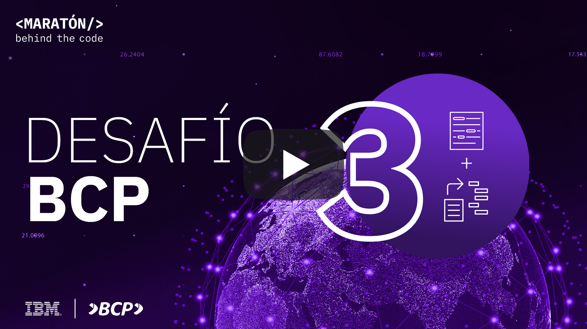
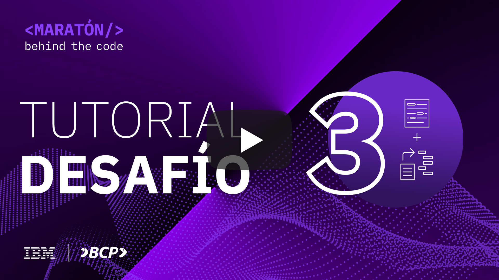
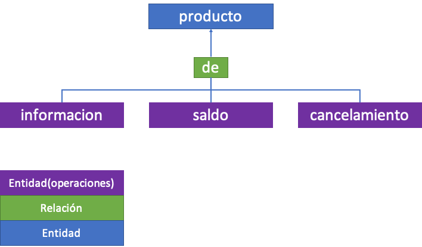
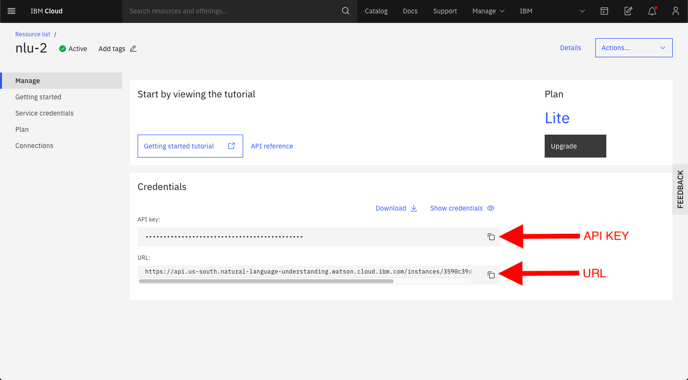
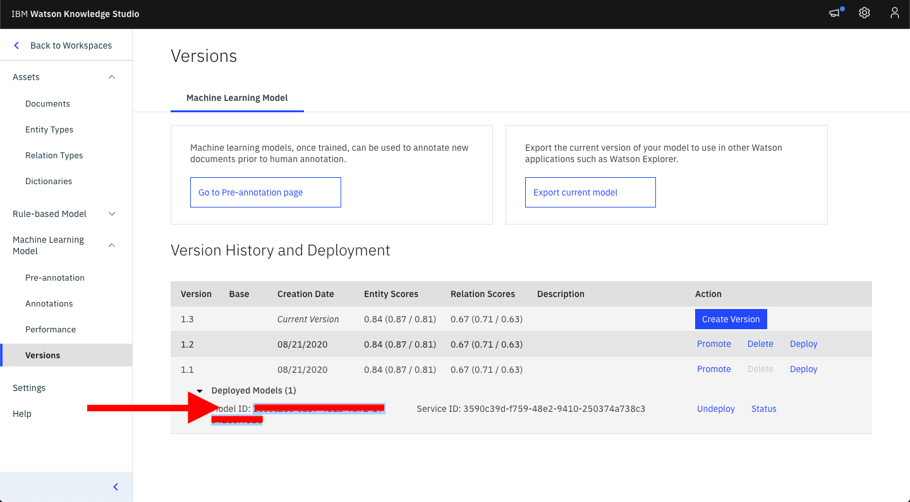
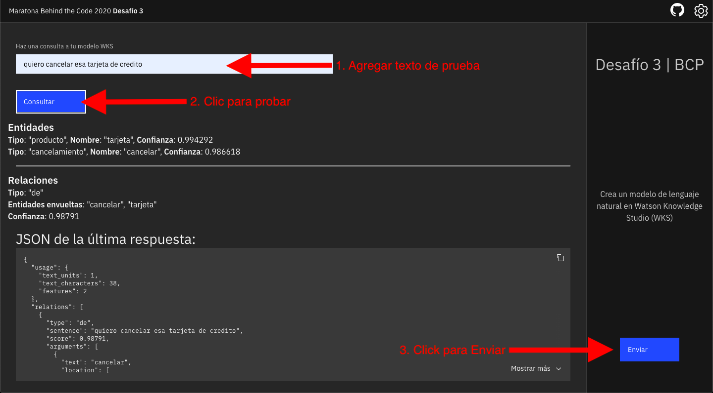
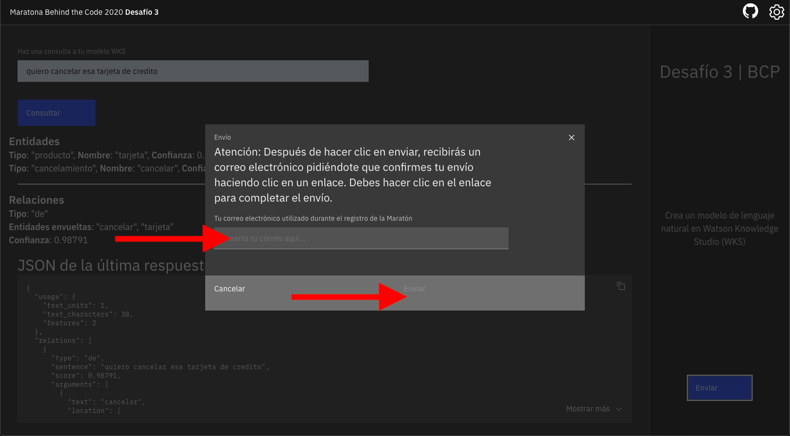

# Desafio 03 | Banco de Crédito del Perú

- [1. Acerca de BCP](#1-acerca-de-bcp)
- [2. Reto de negocio](#2-reto-de-negocio)
- [3. Objetivo](#3-objetivo)
- [4. Desarrollando la solución](#4-desarrollando-la-solución)
  - [4.1. Pre-requisitos](#41-pre-requisitos)
  - [4.2. Resumen de las tareas](#42-resumen-de-las-tareas)
  - [4.3. Desarrollo](#43-desarrollo)
- [5. Envío](#5-envío)
- [6. Sobre la evaluación](#6-sobre-la-evaluación)

## Para Ayudarte

- [Material de apoyo](#material-de-apoyo)
- [Solución de problemas](#solución-de-problemas)
- [Licencia](#licencia)

## 1. Acerca de Banco de Crédito del Perú

El Banco de Crédito del Perú (BCP) es el banco más grande y el proveedor líder de servicios financieros integrados en el Perú. BCP tiene más de 127 años de presencia en el país y es la marca más valiosa del Perú. Su red de más de 8340 puntos de contacto sirve a sus más de 13 millones de clientes. 

    

## 2. Reto de negocio

Siendo la innovación uno de los principales principios del Banco de Crédito del Perú, la búsqueda en brindar experiencias únicas basadas en servicios simples, ágiles y cercanos es una constante para el banco. En lo que respecta a la comunicación con sus clientes el banco está buscando disponibilizar un chatbot que realmente entienda la forma en que hablan sus clientes, comprenda 100% sus intenciones y en base a eso le dé la respuesta más adecuada a su pregunta.

Hoy en día, en el mercado se ven una cantidad de soluciones de chatbots que por lanzarlas rápido o no darle la importancia que ameritan dejan de ser eficientes y por ende dejan de comunicar y complican a los usuarios; dejando de cumplir su función para la que fue creada.

BCP recibe millones de solicitudes diarias de clientes a través de chat y correo electrónico y la mayoría de ellas son personas que buscan más información sobre un producto bancario específico, o una verificación de saldo o que solicitan la cancelación de algún servicio. Como la gran mayoría de preguntas se repiten, es posible automatizar este proceso, pero es necesario clasificarlas primero en grupos.

## 3. Objetivo

El BCP tiene una enorme cantidad de registro de conversaciones, lo que hace que esta tarea sea sobrehumana, sin embargo, con la ayuda de la inteligencia artificial es posible crear un modelo de lenguaje natural que ayude a clasificar una oración. Por tanto, es necesario analizar solo una parte de los registros e inferir el resto de la base a partir de lo extraído.

En este desafío, BCP usará herramientas de IBM como *[Watson Knowledge Studio](https://cloud.ibm.com/catalog/services/knowledge-studio)* y *[Natual Language Understanding](https://cloud.ibm.com/catalog/services/natural-language-understanding)* para construir un modelo de lenguaje natural capaz de extraer entidades y relaciones de un texto, y así entender lo que significa la oración.

La idea esencial del desafío es crear un modelo de lenguaje natural capaz de extraer entidades y relaciones que ayuden en la clasificación de oraciones para que en el futuro el banco pueda implementar eficientemente su sistema de respuesta automática.

## 4. Desarrollando la solución

En este desafío vamos a usar las siguientes herramientas

*[Watson Knowledge Studio](https://cloud.ibm.com/catalog/services/knowledge-studio)* permite entrenar el idioma de un dominio con modelos personalizados de Machine Learning que identifican entidades y relaciones exclusivas de una industria en texto no estructurado. Cree modelos en un entorno grafico diseñado tanto para desarrolladores como para expertos en dominios, sin necesidad de escribir código. Utilice los modelos en Watson Discovery, Watson Natural Language Understanding y Watson Explorer.

*[Natual Language Understanding](https://cloud.ibm.com/catalog/services/natural-language-understanding)* utiliza procesamiento de lenguange natural (NLP) avanzado para analizar texto y extraer metadatos de contenido como conceptos, entidades, palabras clave, categorías, sentimiento, emoción, relaciones y roles semánticos. Aplique modelos de anotación personalizados desarrollados con Watson Knowledge Studio para identificar entidades y relaciones específicas de una industria / dominio en texto no estructurado con Watson NLU.

Mira el tutorial a continuación para aprender como aplicar la tecnología de IBM para resolver el desafío

    

### 4.1. Pre-requisitos

Para poder realizar este desafío, se deben cumplir con los siguientes requisitos previos:

- Regístrate en [Maratón Behind the Code](https://maratona.dev/es) y confirma tu e-mail de registro.
- Tener una cuenta en [IBM Cloud](https://ibm.biz/registro-maratona), que puede ser una cuenta GRATUITA o de pago (no es necesario registrarse en el evento con el mismo correo electrónico utilizado para crear tu cuenta IBM Cloud).

### 4.2. Resumen de las tareas

1. Cree el servicio [Watson Knowledge Studio](https://cloud.ibm.com/catalog/services/knowledge-studio)
2. Cree el servicio [Natural Language Understanding](https://cloud.ibm.com/catalog/services/natural-language-understanding) en la misma región que Watson Knowledge Studio
3. Cree las entidades con los nombres descritos en el [numeral 4.3](#43-desarrollo)
4. Cree la relación "de"
5. Cargue los documentos proporcionados en el directorio [dataset](./doc/source/dataset)
6. Cree un 'Annotation Taks' y agregue un conjunto de documentos
7. Marque los documentos
8. En el lado izquierdo, en la pestaña "Performance", haga clic en "Train and evaluate".
9. Con el modelo entrenado, haga clic en 'Versions' en el lado izquierdo.
10. Haga clic en "Crear version".
11. En la versión creada, haga clic en implementar
12. Seleccione "Natural Language Understanding".
13. Elija su instancia de NLU
14. Guarde el 'Model_id' ya que se utilizará para acceder al modelo creado
15. Acceda a su servicio "Natural Language Understanding" y obtenga "APIKEY" y "URL"
16. Envíe su solicitud a [https://bcp.maratona.dev](https://bcp.maratona.dev)

### 4.3. Desarrollo

Para **Desafío 3**, se solicita al desarrollador que cree un modelo de lenguaje natural en Watson Knowledge Studio (WKS), capaz de extraer entidades y relaciones con los siguientes nombres:

Entidades
- `informacion`
- `saldo`
- `cancelamiento`
- `producto`

Relación
- `de`

En este repositorio, en el directorio [dataset](./doc/source/dataset) hay un archivo zip con el nombre `texts.zip`, dentro de él hay 110 extractos del chat. Es necesario subir los documentos a WKS, crear las entidades y relaciones y marcar lo que representa cada uno.

La relación `de` está definida entre dos entidades, donde la primera actúa sobre la segunda. Al configurar la relación, defina que entidad es la primera, es decir, la que actúa sobre la segunda, aquí es importante especificar qué entidades pueden ser las primeras y cuáles pueden ser las segundas. Para este desafío, la relación de `de` debe tener como primera entidad` informacion`,` saldo` o `cancelamiento`; `product` debe ser la segunda entidad. La tabla muestra cómo se debe configurar la relación.

  

  <table class="tg">
  <thead>
    <tr>
      <th class="tg-c3ow">Relacion</th>
      <th class="tg-c3ow">Primera entidad</th>
      <th class="tg-baqh">Segunda entidad</th>
    </tr>
  </thead>
  <tbody>
    <tr>
      <td class="tg-c3ow">de</td>
      <td class="tg-c3ow">informacion, saldo,cancelamiento </td>
      <td class="tg-baqh">producto </td>
    </tr>
  </tbody>
  </table>

Para marcar documentos en WKS, deberá crear una 'Annotation set' e insertar los documentos en la tarea como 'Annotation set'. Luego, marque/anote los documentos.

La siguiente tabla detalla lo que representa cada entidad y un marcado sugerido.

  <h3>Ejemplo de entidad a ser marcado en WKS</h3>
  <table class="tg">
  <thead>
    <tr>
      <th class="tg-c3ow">Entidad</th>
      <th class="tg-c3ow">Ejemplo de marcado</th>
    </tr>
  </thead>
  <tbody>
    <tr>
      <td class="tg-c3ow">informacion</td>
      <td class="tg-c3ow">Cómo funciona... Necesito saber... saber más sobre...</td>
    </tr>
    <tr>
      <td class="tg-c3ow">saldo</td>
      <td class="tg-c3ow">saber el saldo... consultar el saldo...</td>
    </tr>
    <tr>
      <td class="tg-c3ow">cancelamiento</td>
      <td class="tg-c3ow">Cancela... solicito cancelación</td>
    </tr>
    <tr>
      <td class="tg-c3ow">producto</td>
      <td class="tg-c3ow">tarjeta de crédito ahorros cuenta corriente crédito vehicular Credimas transferencia</td>
    </tr>
  </tbody>
  </table>

Con todos los documentos marcados, debe enviar las notas de la tarea y aceptarlas. Una vez realizado este procedimiento, en el lado izquierdo, en la pestaña 'Performance', estará disponible el entrenamiento del modelo de lenguaje natural. Simplemente haga clic en 'Train and evaluate' y configure las proporciones de entrenamiento, prueba y validación. Después de unos minutos, el modelo estará disponible para su uso.

El despliegue del modelo creado debe realizarse en una instancia de *Natural Language Understanding*, para eso, en el lado izquierdo, en la pestaña 'Versions' simplemente haga clic en 'Create version'. Una vez que se haya creado la versión, haga clic en 'deploy', seleccione 'Natural Language Understanding' y luego elija su instancia de servicio. Al final, se generará un ID para su modelo, guárdelo ya que será necesario para el envío.

## 5. Envío

Para realizar el envío debes acceder a la página: [https://bcp.maratona.dev](https://bcp.maratona.dev) e insertar la `APIKEY` y `URL` de tu instancia *Natural Language Uderstanding* y el `Model_id` del modelo creado en WKS. En esta página podrás enviar frases al servicio y comprobar si las entidades y relaciones extraídas son correctas.

A continuación se muestra una imágenes de dónde encontrar las credenciales de Natural Language Understanding:
</img>
A continuación se muestra una imágen de dónde encontrar el `Model_id` del modelo creado en WKS:
</img>

🚨 **PRUEBA TU SOLUCIÓN ANTES DE PRESENTARLA** 🚨

Después de realizar las pruebas, haga clic en el botón en la esquina inferior derecha para ENVIAR su solución, como se muestra en la imagen a continuación, y complete el formulario con su dirección de correo electrónico utilizada para la inscripción en MARATONA 2020.

Probar:
</img>
Enviar:
</img>

## 6. Sobre la evaluación

El sistema de evaluación probará si su modelo de anotación puede extraer correctamente las entidades y relaciones propuestas y la confianza de la extracción en cada una. La evaluación se lleva a cabo enviando frases de prueba donde se conoce la respuesta. La respuesta del usuario se comparará con la esperada, si son iguales el valor de confianza de lo extraído se multiplicará por una constante. En caso de ser diferentes la respuesta es incorrecta.

La rapidez de entrega no se incluye en el cálculo de la puntuación del desafío. Sin embargo, para todos los participantes que presenten este desafío en la primera semana después del lanzamiento, recibirán una bonificación en la puntuación final.

Recuerde que tiene 3 oportunidades de envío de la solución del reto donde se le tomará en cuenta el envío que obtenga mejor puntuación.

## Material de apoyo

- [Video Watson Knowledge Studio](https://www.youtube.com/watch?v=bdZMKNjp9bQ)
- [Watson Knowledge Studio Docs](https://cloud.ibm.com/docs/watson-knowledge-studio?topic=watson-knowledge-studio-wks_tutintro)
- [Natural Language Undestanding Docs](https://cloud.ibm.com/docs/natural-language-understanding?topic=natural-language-understanding-getting-started)

## Solución de problemas

Mira el [video explicativo](#4-desarrollando-la-solucion) provisto en la Sección 4, o si lo deseas, revisa la documentación de los servicios involucrados en este desafío:

Accede al discord oficial de la Maratón 2020 para hacer preguntas y/o interactuar con otros participantes: [Discord](https://discord.gg/Q9At74C).

## Licencia

Copyright 2020 Maratona Behind the Code

Licensed under the Apache License, Version 2.0 (the "License");
you may not use this file except in compliance with the License.
You may obtain a copy of the License at

       http://www.apache.org/licenses/LICENSE-2.0

Unless required by applicable law or agreed to in writing, software
distributed under the License is distributed on an "AS IS" BASIS,
WITHOUT WARRANTIES OR CONDITIONS OF ANY KIND, either express or implied.
See the License for the specific language governing permissions and
limitations under the License.
